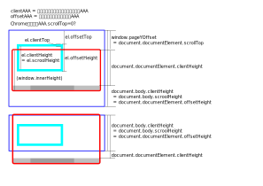

# YT Scheduler


## 主な特徴

システム手帳(1ページ一週間のタイプ)のリフィルをイメージして、
手帳の柔軟性とスマホの使い勝手を生かしたスケジュール帳を
目指してます。

* 自分専用！

  - プライベートな手帳としては「あたりまえ」！
  - スケジュールの共有や一部公開などは、一切考えないため、シンプル。

* スケジュールだけでなく、ToDo、日記、メモなど、
  何でも手軽に書き込める。

  - 最適化より柔軟性重視

* スマホの使い勝手を活かす。

  - 無限にスクロール
  - 検索機能、フィルター機能
  - 書き込みスペースを気にせず、たくさん書き込むことも可能

* ユーザー認証(ID, パスワード)やクライアント認証(証明書)は、
  リバースプロキシに任せる！
  
  - 単一ユーザだからこそ。
  - この方が、本ソフトのバグによるセキュリティホールや脆弱性の問題を
    最小限に抑えられる。
  - 本ソフトのロジックが簡単になる。

* 長年使い続けていくと、
  後にどのようなシステムに刷新されるかわからないので、
  あえて、データベースは使わず、
  潰しが効くテキスト形式(独自)のデータ。
  
  - 個人の情報量なら、数十年分のスケジュールを
    メモリ上にキャッシング可能で、パフォーマンスも問題ない。

  - データベースでも通常はバックアップしたり、
    エクスポートしたりできるが、
    時代とともに、
    データベースそのものの仕様が大きく変わる可能性を考えると
    不安がある。

  - 実際、10年以上前に、Perl CGIで作成したデータを
    そのまま使えるようにしている。


## その他の特徴

* フィルター機能 (プライバシー保護などにも有効)

  フィルター文字列にマッチするスケジュールのみ表示する。
  先頭に「!」をつけると「not」の意味になる
  (フィルター文字列を含まないスケジュールを表示)。
  

* ToDoの期限が近づくと(あるいは期限をすぎると)、
  今日の予定として表示される。
  
  何日以内の ToDo を今日の予定として表示するか調整可能。

* 画面の端にゲージを表示

  現在表示されているスケジュールが
  「今日」からどれぐらい離れているか直感的にわかりやすい。

## 基本ルール

* 太字強調

  タイトルに「!」「★」をつけると「重要」の意味(太字強調される)

* 取り消し

  タイトルの先頭に「(欠)」、「(キャンセル)」などをつけると、
  「取り消し」の意味 (取り消し線が入る)

* ToDo

  タイプを「□」にすると、「ToDo」項目と見なす


## 課題・問題点

* 検索機能が使いにくい

* 期間スケジュール、繰り返しスケジュールに未対応

  - 手書きき同様、繰り返し書き込む必要がある

  - 現状では、繰り返し登録がなるべくしやすいように
    UI工夫して対応するしかない


## memo

### Javascript ``Date``の罠

new Date()の日付の区切り文字が
   '/' だとJST(+09:00),
   '-' だとUTC
とみなされる！

(ex.)
```
> (new Date("2021/01/01")).toISOString();
"2020-12-31T15:00:00.000Z"
> (new Date("2021-01-01")).toISOString();
"2021-01-01T00:00:00.000Z"
```

### Javascript scroll, size関連


