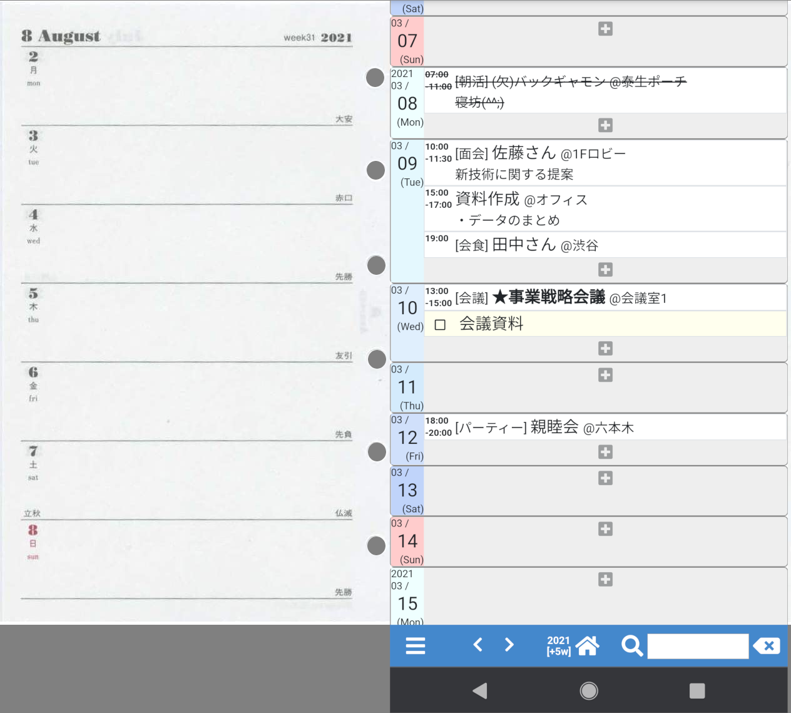

# YT Scheduler

## 概要

システム手帳の1ページ一週間のタイプのリフィルをイメージして作りました。

* スケジュール以外に、ToDo、日記、メモなど、
  何でも手軽に書き込める。
  - 最適化より柔軟性重視

* スマホの使い勝手を活かす。
  - 無限にスクロール
  - 検索機能、フィルター機能

* 長年使い続け、
  後にどのようなシステムに刷新されるかわからないので、
  データベースはあえて使わず、
  潰しが効くテキストベースのデータファイル
  
  (実際、昔、Perl CGIで作成したデータを
  そのまま使える様にしてます。)

## 基本ルール

* タイトルに「!」「★」をつけると「重要」の意味(太字強調される)
* タイトルに「(欠)」、「(キャンセル)」などをつけると、
  「取り消し」の意味 (取り消し線が入る)
* タイプを「□」にすると、「ToDo」項目と見なす

## 課題・問題点

* 期間スケジュール、繰り返しスケジュールに未対応

  →手書き同様、繰り返し書き込む必要がある

  →現状では、繰り返し登録がなるべくしやすいようにUI工夫して対応

## memo

### Javascript scroll

